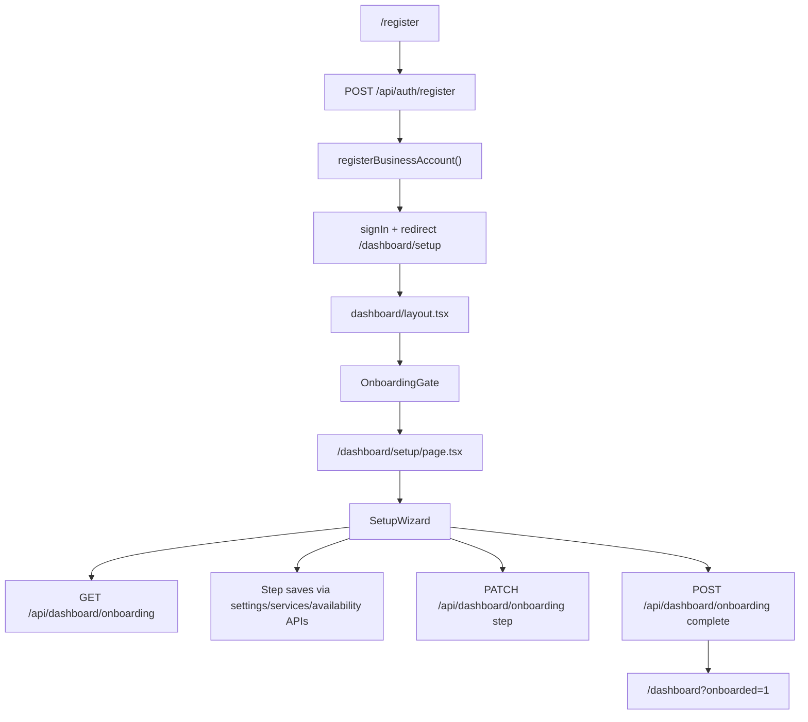

# Onboarding Technical Audit — Dinaya Setup Wizard

**Scope:** `SetupWizard.tsx`, `OnboardingGate.tsx`, `/api/dashboard/onboarding`, `register-business-account.ts`, `dashboard/layout.tsx`, and directly coupled routes/helpers.

**Date:** 2026-06-23  
**Auditor:** Subagent 2 (orchestration technical audit)

---

## Executive summary

The onboarding flow is a **4-step owner-only wizard** gated at the dashboard layout level, seeded atomically at registration, and persisted via `businesses.onboarding_step` / `businesses.onboarding_completed_at`. The architecture is sound for the happy path (register → sign-in → `/dashboard/setup` → finish → dashboard), but several **consistency, validation, and edge-case gaps** can cause confusing resume behavior, staff redirect loops, silent language reset, and non-atomic completion side effects.

| Area | Rating | Notes |
|------|--------|-------|
| Route & auth gating | Good | Owner-only setup page + `OnboardingGate` redirect |
| Registration seed | Strong | Single DB transaction in `registerBusinessAccount` |
| State persistence | Mixed | Step marker separate from step saves; back button is local-only |
| Validation | Mixed | UI stricter than API; settings PATCH applies Zod defaults |
| Resume | Good | `onboardingStep + 1` on load; data rehydrated from DB |
| Loading/error UX | Mixed | Skeleton + retry exist; HTTP errors not distinguished |
| Mobile | Good | `min-h-11` targets, responsive grid, touch-friendly pills |
| DB atomicity (wizard) | Weak | Multi-request steps; availability delete+insert not transactional |
| Test coverage | None | No unit or e2e tests for onboarding |

---

## Architecture overview



**Related but separate:** `OnboardingWizard` in `src/components/dashboard/OnboardingWizard.tsx` is a **post-completion checklist** on the dashboard overview (`DashboardOverview.tsx`), not the first-run setup wizard audited here.

---

## File map

| File | Role |
|------|------|
| `src/lib/auth/register-business-account.ts` | Atomic account + business + staff + services + availability seed |
| `src/app/api/auth/register/route.ts` | Registration API; rate-limited; calls `registerBusinessAccount` |
| `src/app/(auth)/register/page.tsx` | Client register → auto sign-in → `/dashboard/setup` |
| `src/app/auth/signin/page.tsx` | `?registered=1` forces callback `/dashboard/setup` |
| `src/app/dashboard/layout.tsx` | Loads `onboardingCompletedAt`; wraps children in `OnboardingGate` + `DashboardShell` |
| `src/components/dashboard/OnboardingGate.tsx` | Client redirect guard between dashboard and setup |
| `src/app/dashboard/setup/page.tsx` | Server page: owner-only, redirects if already complete |
| `src/components/dashboard/SetupWizard.tsx` | 4-step wizard UI and client orchestration |
| `src/app/api/dashboard/onboarding/route.ts` | GET state, PATCH step, POST complete |
| `src/components/dashboard/SetupWizardSkeleton.tsx` | Loading placeholder (gate + wizard) |
| `src/components/dashboard/DashboardShell.tsx` | `minimalChrome` strips nav during setup |
| `drizzle/0017_onboarding.sql` | Schema + backfill existing tenants as complete |

---

## 1. Routes & navigation

### Entry points (auth trigger)

1. **Registration** — `src/app/(auth)/register/page.tsx` → `handleSubmit`:
   - `POST /api/auth/register` → `registerBusinessAccount()`
   - `signIn("credentials", { callbackUrl: …/dashboard/setup })`
   - `router.push("/dashboard/setup")`

2. **Sign-in after failed auto-login** — `src/app/auth/signin/page.tsx` → `getSafeCallbackUrl()`:
   - `?registered=1` → `/dashboard/setup`

3. **Incomplete onboarding return visit** — `OnboardingGate` → `router.replace("/dashboard/setup")` when `!completed && !onSetup`

### Gating layers (defense in depth)

| Layer | File | Function / logic | Behavior |
|-------|------|------------------|----------|
| Layout | `layout.tsx` | `onboardingCompleted` query | Passes `completed` to gate; `minimalChrome={!onboardingCompleted}` |
| Client gate | `OnboardingGate.tsx` | `useEffect` | Redirect incomplete users to setup; completed users away from setup |
| Server page | `setup/page.tsx` | `SetupPage` | `role !== "owner"` → `/dashboard`; `onboardingCompletedAt` → `/dashboard` |
| Wizard load | `SetupWizard.tsx` | `useEffect` fetch | `data.completed` → `router.replace("/dashboard")` |

### Issues

#### P1 — Staff redirect loop when onboarding incomplete

**Files:** `OnboardingGate.tsx` (`useEffect`), `setup/page.tsx` (`SetupPage`)

- `OnboardingGate` sends **all** incomplete sessions to `/dashboard/setup`.
- `SetupPage` redirects **non-owners** to `/dashboard`.
- A staff user on a business where `onboarding_completed_at` is null bounces indefinitely (skeleton ↔ redirect).

**Fix:** In `OnboardingGate.tsx`, only redirect to setup when `completed === false` **and** user is owner (pass `role` from layout). In `layout.tsx`, pass `role` into `OnboardingGate`. Alternatively, treat staff as “completed” for gate purposes when `role !== "owner"`.

#### P2 — `onboarded=1` query param is unused

**File:** `SetupWizard.tsx` → `handleFinish`

- Navigates to `/dashboard?onboarded=1` but nothing reads this param (no toast, analytics pageview hook, or dashboard banner).
- `trackOnboardingComplete()` fires client-side only.

**Fix:** Consume in `src/app/dashboard/page.tsx` or a client banner component; or remove the param.

#### P3 — Duplicate redirect flash

**File:** `OnboardingGate.tsx`

- When `completed && onSetup`, component returns `null` until `useEffect` runs `router.replace("/dashboard")` — brief blank frame.

**Fix:** Server redirect in `setup/page.tsx` already handles this; consider SSR-only redirect and drop client duplicate, or render skeleton until navigation completes.

---

## 2. State persistence

### DB fields (`src/db/schema.ts`)

- `onboarding_step` — integer, default `0`, not null
- `onboarding_completed_at` — timestamp, null until finish

### Step semantics

| Wizard UI step | `persistStep(n)` value | Meaning |
|----------------|------------------------|---------|
| 1 (page info) | `1` | After settings saved |
| 2 (service) | `2` | After first service patched |
| 3 (hours) | `3` | After availability saved |
| 4 (share) | `4` | Set on `POST` complete |

**Resume formula** (`SetupWizard.tsx` line ~162):

```ts
const initialStep = Math.max(1, Math.min(4, (data.business.onboardingStep || 0) + 1));
```

- `onboardingStep = 0` (new account) → UI step **1** ✓
- `onboardingStep = 1` → UI step **2** ✓

### Registration seed (`register-business-account.ts`)

`registerBusinessAccount()` runs one `db.transaction()` inserting:

- `businesses` (plan trial, policies; **no** `onboardingCompletedAt` → null)
- `users` (owner)
- `staff` (owner as first staff)
- `services` (type-specific presets from `PRESET_SERVICES`)
- `staffServices`, `availability` (Mon–Sat 09:00–17:00), `locations`, `staffLocations`, `messageTemplates`

`onboarding_step` relies on schema default `0` — correct.

### Persistence per step (`SetupWizard.tsx`)

| Step | Data API | Progress API |
|------|----------|--------------|
| 1 | `PATCH /api/dashboard/settings` | `persistStep(1)` → `PATCH /api/dashboard/onboarding` |
| 2 | `PATCH /api/dashboard/services/{id}` | `persistStep(2)` |
| 3 | `POST /api/dashboard/availability` | `persistStep(3)` |
| 4 | `POST /api/dashboard/onboarding` | Sets `onboardingCompletedAt`, directory flags, AI config |

### Issues

#### P1 — Split writes: data saved, step marker may fail

**Files:** `SetupWizard.tsx` → `handleStep1`, `handleStep2`, `handleStep3`; `onboarding/route.ts` → `PATCH`

Each step is **two HTTP requests**. If the data PATCH succeeds but `persistStep` fails, the user sees an error but data is persisted. On refresh, resume lands on the **old** step with **new** data — confusing but not data-loss.

**Fix options:**
- Combine step data + `onboarding_step` in a dedicated onboarding mutation endpoint inside one transaction.
- Or call `persistStep` before advancing UI only after both succeed (current), but add idempotent retry on `persistStep`.

#### P2 — Back button does not regress `onboarding_step`

**File:** `SetupWizard.tsx` — `setStep(1|2|3)` on Back buttons

Local UI goes backward; DB step unchanged. Refresh jumps forward again.

**Fix:** Optional `PATCH` with decremented step on back, or document as intentional (low priority).

#### P3 — `PATCH` step has no monotonic guard

**File:** `onboarding/route.ts` → `PATCH`

`stepSchema` allows `0–4` with no check against current step or completed prerequisites. Owner could skip steps via API.

**Fix:** Validate `step <= currentStep + 1` or require completed field checks before accepting higher steps.

#### P4 — POST complete is not fully atomic

**File:** `onboarding/route.ts` → `POST`

Sequence:
1. `UPDATE businesses` (complete + directory)
2. `updateLocationAiConfig()` (separate update)

If (2) throws, onboarding is marked complete but `clientReactivationCampaign` may not be enabled.

**Fix:** Wrap in `db.transaction()` in `POST`, or move AI config update into the same transaction.

#### P5 — Availability update not transactional

**File:** `src/lib/dashboard/availability.ts` → `updateAvailabilityDashboardWindows`

`DELETE` all rows for `staffId`, then `INSERT` new rows — not in a transaction. Failure after delete leaves empty availability.

**Fix:** Use `db.transaction()` around delete + insert.

---

## 3. Validation

### Step 1 — Business details

| Layer | Phone | Address | Description |
|-------|-------|---------|-------------|
| UI (`SetupWizard.tsx`) | `required` | `required` | `required` |
| API (`settings/route.ts` → `settingsSchema`) | optional, max 20 | optional, max 1000 | optional, max 2000 |

**Mismatch:** Client blocks empty fields; API accepts nulls. Direct API calls could complete step 1 with incomplete public page data.

**Additional bug — Zod defaults overwrite language/timezone**

**Files:** `settings/route.ts` → `settingsSchema`, `SetupWizard.tsx` → `handleStep1`

Wizard sends only `{ name, description, phone, address }`. Schema applies:
- `timezone.default("Asia/Colombo")`
- `language.default("en")`
- `galleryImages.default([])`

PATCH handler **always** writes these to DB. Users who registered with `language: "si"` or `"ta"` get reset to English on step 1.

**Fix:** In `settings/route.ts` → `PATCH`, only update fields present in the request body (partial patch), or send `language` from wizard GET payload in `handleStep1`.

### Step 2 — Service

**Files:** `SetupWizard.tsx` → `handleStep2`; `services/[id]/route.ts` → `PATCH`; `serviceUpdateSchema`

- UI: required name, duration ≥ 5, price ≥ 0
- API: `serviceUpdateSchema` with `z.coerce.number()` — aligned
- **Risk:** If `firstService` is null, `service.id` is `""` → `PATCH /api/dashboard/services/` → 404. Registration always seeds services, so unlikely unless manually deleted.

**Fix:** Guard in `SetupWizard.tsx` load effect: if `!data.firstService`, show error state or create default service via API.

### Step 3 — Availability

**Files:** `SetupWizard.tsx` → `handleStep3`; `availability/route.ts` → `POST`; `validateAvailabilityRows`

- UI disables submit when `availRows.length === 0`
- API validates time ranges and overlaps
- `staffId` required; wizard checks `!staffId` before submit
- **Auth:** availability `POST` uses `requireApiBusiness` **without** `ownerOnly` — staff could mutate hours if they reached the API (they cannot reach setup UI)

**Fix (consistency):** Add `ownerOnly: true` to availability `POST` during onboarding context, or globally for write operations.

### Step 4 — Complete

**File:** `onboarding/route.ts` → `POST`

- Idempotent if already complete (updates directory listing if missing)
- `inferDirectoryCategory`, `inferDirectoryCity` — best-effort from `businessType` / `address`

No validation that steps 1–3 data quality is sufficient before marking complete.

---

## 4. Resume behavior

### Happy path resume

1. User completes step 1 → `onboarding_step = 1`
2. Closes browser
3. Returns → `OnboardingGate` → `/dashboard/setup`
4. `GET /api/dashboard/onboarding` returns business fields, `firstService`, `staffList[0]`, `availabilityRows`, `bookingUrl`
5. Wizard opens at step `(onboardingStep + 1)` with form pre-filled

### Default availability when empty

If `availabilityRows.length === 0`, wizard defaults Mon–Fri 09:00–17:00. Registration seeds Mon–Sat, so new users see DB rows, not defaults.

### Migration backfill

`drizzle/0017_onboarding.sql` sets `onboarding_completed_at = created_at` for all existing rows — legacy tenants skip wizard. `layout.tsx` try/catch defaults to `completed = true` if column missing (deploy race protection).

### Issues

#### P2 — GET fetch ignores HTTP status

**File:** `SetupWizard.tsx` → `useEffect`

```ts
fetch("/api/dashboard/onboarding")
  .then((r) => r.json())
```

401/403/404 responses still parse JSON; wizard may render empty forms instead of `loadFailed`.

**Fix:** Check `r.ok`; on failure set `loadFailed` or show auth-specific message.

#### P3 — No handling for `firstService` missing on resume

Same as validation — step 2 breaks silently on empty `service.id`.

---

## 5. Auth & authorization

| Endpoint | Auth | Owner only |
|----------|------|------------|
| `GET /api/dashboard/onboarding` | `requireApiBusiness({ ownerOnly: true })` | ✓ |
| `PATCH /api/dashboard/onboarding` | `requireApiBusiness({ ownerOnly: true })` | ✓ |
| `POST /api/dashboard/onboarding` | `requireApiBusiness({ ownerOnly: true })` | ✓ |
| `PATCH /api/dashboard/settings` | `requireApiBusiness({ ownerOnly: true })` | ✓ |
| `PATCH /api/dashboard/services/[id]` | `requireApiBusiness({ ownerOnly: true })` | ✓ |
| `POST /api/dashboard/availability` | `requireApiBusiness` | ✗ |

**Impersonation:** `requireApiBusiness` blocks non-GET mutations for `readOnlyImpersonation` — onboarding cannot be completed while impersonating (correct).

**Registration:** `withRateLimit` 5 req / 15 min on `register` scope.

---

## 6. Loading & error states

### Loading

| State | Component | Trigger |
|-------|-----------|---------|
| Gate redirect | `SetupWizardSkeleton` | `OnboardingGate` when `!completed && !onSetup` |
| Wizard hydrate | `SetupWizardSkeleton` | `SetupWizard` `loading === true` |
| Booking preview | Spinner in `BookingPreviewFrame` | iframe `onLoad` |
| Save | Button disabled + `aria-busy` + saving CTA text | `saving` state |

### Errors

| State | Handling |
|-------|----------|
| Load network failure | `loadFailed` → full-page retry (`window.location.reload()`) |
| Step save failure | `role="alert"` with API `error` or fallback copy |
| `persistStep` failure | Generic “Couldn't save your progress” |
| Preview iframe timeout | 12s → fallback link (`BookingPreviewFrame`) |

### Gaps

- No distinction between 401 (session expired) vs 500 vs offline on initial load
- `handleFinish` does not call `router.refresh()` before push (it does call refresh after push — order may stale layout `onboardingCompleted` briefly)
- Register `handleSubmit` catch block sets error but may not reset `loading` on success path (success returns early — OK)

**Fix:** In `SetupWizard.tsx` load effect, branch on `res.status`. In `handleFinish`, `await` refresh or rely on `router.push` + layout re-fetch.

---

## 7. Mobile & accessibility

### Strengths (`SetupWizard.tsx`, `SetupWizardSkeleton.tsx`)

- `min-h-11` on primary actions and time inputs (44px touch targets)
- `inputMode="tel"`, `autoComplete` on phone/address
- `flex-wrap` day pills; `grid-cols-2` for duration/price
- `role="progressbar"` with `aria-valuenow/min/max`
- `aria-pressed` on day toggles
- `motion-reduce:animate-none` on skeleton/spinner
- `max-w-2xl` centered layout works on narrow viewports
- Text scales: `text-[17px] sm:text-sm` for readable mobile body copy

### Gaps

- Time inputs in step 3 can overflow on very narrow screens (`flex` row with fixed `w-10` day label + two time pickers) — consider `flex-col` below `sm`
- No `aria-current="step"` on progress indicator
- Back/primary button row may be tight on 320px width — acceptable but worth visual QA
- iframe preview fixed `h-64` — fine for mobile

---

## 8. DB atomicity summary

| Operation | Atomic? | Location |
|-----------|---------|----------|
| Account registration | ✓ Transaction | `registerBusinessAccount()` |
| Step 1 save + step marker | ✗ Two requests | `handleStep1` + `persistStep` |
| Step 2 save + step marker | ✗ Two requests | `handleStep2` + `persistStep` |
| Step 3 save + step marker | ✗ Two requests | `handleStep3` + `persistStep` |
| Availability replace | ✗ Delete then insert | `updateAvailabilityDashboardWindows` |
| Onboarding complete + directory + AI | ✗ Sequential updates | `onboarding/route.ts` → `POST` |

---

## 9. Prioritized fix list

### P0 — Ship blockers / user-breaking

| # | Issue | Primary file | Function / area |
|---|-------|--------------|-----------------|
| 1 | Staff redirect loop when onboarding incomplete | `OnboardingGate.tsx` | `OnboardingGate` — pass `role`, skip setup redirect for staff |
| 2 | Language reset to `en` on step 1 save | `settings/route.ts` | `PATCH` — partial update only; or `SetupWizard.tsx` `handleStep1` — include `language` |

### P1 — High priority

| # | Issue | Primary file | Function / area |
|---|-------|--------------|-----------------|
| 3 | GET onboarding ignores `res.ok` | `SetupWizard.tsx` | `useEffect` fetch handler |
| 4 | Availability delete+insert not transactional | `availability.ts` | `updateAvailabilityDashboardWindows` |
| 5 | POST complete not transactional with AI config | `onboarding/route.ts` | `POST` |
| 6 | Missing `firstService` breaks step 2 | `SetupWizard.tsx` | load `useEffect` / `handleStep2` |

### P2 — Medium priority

| # | Issue | Primary file | Function / area |
|---|-------|--------------|-----------------|
| 7 | UI requires phone/address; API optional | `settings/route.ts` or `SetupWizard.tsx` | `settingsSchema` / form validation alignment |
| 8 | `onboarded=1` unused | `dashboard/page.tsx` or `SetupWizard.tsx` | `handleFinish` consumer |
| 9 | Back button vs persisted step | `SetupWizard.tsx` | Back handlers + optional `persistStep` |
| 10 | PATCH step allows arbitrary jumps | `onboarding/route.ts` | `PATCH` validation |
| 11 | Split step writes (data vs marker) | New route or `onboarding/route.ts` | Combined mutations |
| 12 | Availability POST not `ownerOnly` | `availability/route.ts` | `POST` auth options |

### P3 — Low / polish

| # | Issue | Primary file | Function / area |
|---|-------|--------------|-----------------|
| 13 | Completed-on-setup blank flash | `OnboardingGate.tsx` | `useEffect` redirect |
| 14 | No onboarding tests | `e2e/` or `src/**/*.test.ts` | Add coverage |
| 15 | Step 3 mobile time row layout | `SetupWizard.tsx` | step 3 availability row `className` |
| 16 | `inferDirectoryCity` hardcoded list | `onboarding/route.ts` | `inferDirectoryCity` |

---

## 10. Suggested test cases (not implemented)

1. **E2E:** Register → land on step 1 → complete all steps → dashboard loads without redirect loop
2. **E2E:** Resume at step 2 after abandoning at step 1
3. **Unit:** `initialStep` from `onboardingStep` 0–4
4. **API:** `POST` complete idempotency (`alreadyCompleted`)
5. **API:** Staff session on incomplete business does not loop (after P0 fix)
6. **Integration:** Register with `language: "si"` → step 1 save preserves `si`

---

## 11. Conclusion

Onboarding is **production-viable for new owner signups** with solid registration seeding, layered route guards, and reasonable mobile UX. The highest-risk defects are the **staff redirect loop** (edge case but hard-blocking), **silent language reset** on step 1 (affects si/ta registrants), and **non-atomic multi-request step persistence** (confusing resume, rare data inconsistency on availability). Addressing P0/P1 items in the table above would bring the flow to a robust baseline; adding e2e coverage should follow any gate logic changes.
